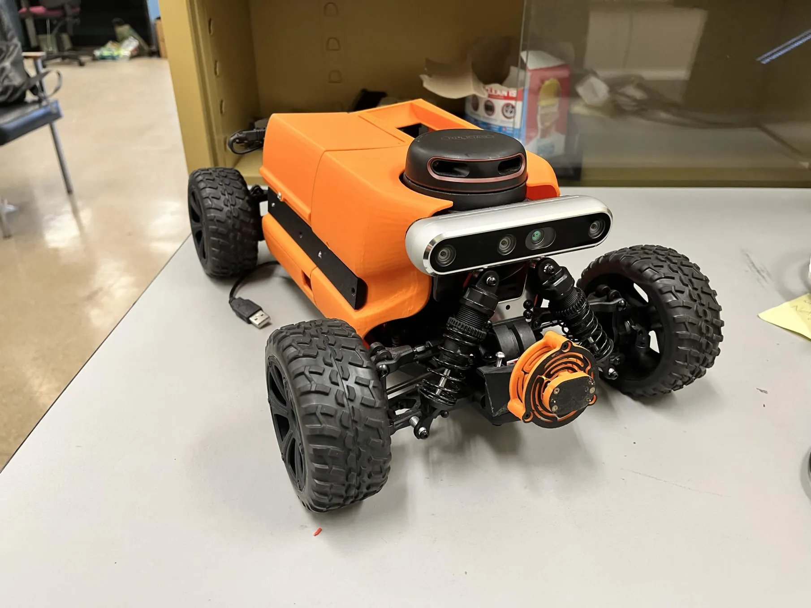

# Powersense_RC_Car: Energy-Efficient Autonomous Navigation Benchmarking



With generous help from Dr. Marco Brocanelli and his lab, I am building a research-oriented framework designed to profile the energy-to-performance trade-offs of autonomous platforms. By integrating high-fidelity sensors (Intel RealSense & RPLidar) with variable computational and network constraints, this project aims to identify the sweet spot for power efficiency in edge robotics.

## 🚀 Project Overview
Modern autonomous systems often struggle with the "Power vs. Perception" paradox. Increasing sensor resolution and CPU frequency improves navigation accuracy but drastically reduces battery life. Conversely, offloading compute-intensive activities to edge servers reduces the computing power cost on the robot, but at the cost of increased network latency.

My goal is to provide a systematic method to measure how different configurations affect a robot's ability to navigate safely while improving energy efficiency for edge-computation.

**Key Variables Tested:**
* **Compute:** CPU frequency scaling (Throttling vs. Performance modes).
* **Network:** Onboard processing vs. Edge-offloading (WiFi/5G latency impact).
* **Sensing:** Lidar point-cloud density and RealSense depth resolution.
* **Optimization:** Quantized vs. Full-precision neural networks for path planning.
* **Model Scaling:** Larger vs. smaller object detection models (e.g., YOLOv8-full vs. YOLOv8-n).

---

> 📣 **Follow the Build!**
>
> I post daily progress updates, benchmarks, and lessons learned on the Open Robotics forum:
>
> 🔗 [**Energy-Efficient Autonomous Navigation Benchmarking** — Open Robotics Discourse](https://discourse.openrobotics.org/t/energy-efficient-autonomous-navigation-benchmarking/53208?u=rocky_shao)

---

## 🛠 Hardware Stack
| Component | Model | Role |
| :--- | :--- | :--- |
| **Chassis** | RC Chassis | Mobile platform |
| **Vision** | Intel RealSense D455 | Stereo depth & VSLAM |
| **Lidar** | RPLidar A2M8 | 2D/3D Obstacle detection |
| **Compute** | Jetson Nano | Onboard inference |
| **Power Mon.** | TI INA3221 | 3-ch voltage/current/power sensing |
| **Power Mon.** | Adafruit INA260 | High-side current/voltage/power sensing |

## 📊 Benchmarking Methodology
We evaluate configurations using the Energy-per-Meter (EpM) metric:

$$EpM = \frac{\int_{0}^{t} P(t) dt}{d}$$

Where $P$ is power in Watts, $t$ is time, and $d$ is total distance traveled.

**Test Matrix:**
* **Baseline:** All sensors active, max CPU clock, local inference.
* **Eco-Mode:** Reduced Lidar frequency, CPU undervolting.
* **Cloud-Hybrid:** Offloading SLAM processing to a local edge server.

## 📂 Repository Structure
```text
├── hardware_testing/
│   └── Power_Monitor_INA3221/   # ESP32 PlatformIO firmware for INA3221 testing
├── mystuff/                     # Datasheets, pictures, and helper scripts
├── notes/                       # Research notes and datasheets
└── src/
    ├── camera_realsense/        # ROS 2 package for RealSense integration
    ├── power_monitor/           # ROS 2 package for power monitoring (WIP)
    └── rplidar_a2m8/            # ROS 2 package for RPLidar A2M8 LaserScan publishing
```

## 📈 Getting Started
*(Instructions for building and running the ROS 2 workspace will be added as the project develops.)*

## RPLidar A2M8 ROS 2 Node
The package `rplidar_a2m8` publishes `sensor_msgs/LaserScan` on `/scan`.

### 1. Environment Setup Order (required)
```bash
source /home/rocky/Powersense_RC_Car/venv/bin/activate
export PYTHONPATH="$(python3 -c 'import site; print(site.getsitepackages()[0])'):$PYTHONPATH"
source /opt/ros/jazzy/setup.bash
```

### 2. Install Python Driver
```bash
pip install rplidar-roboticia
```

### 3. Build and Source Overlay
```bash
cd /home/rocky/Powersense_RC_Car
colcon build --packages-select rplidar_a2m8
source /home/rocky/Powersense_RC_Car/install/setup.bash
```

### 4. Launch Node
```bash
ros2 launch rplidar_a2m8 rplidar.launch.py
```

Or use helper script:
```bash
bash /home/rocky/Powersense_RC_Car/mystuff/custom_commands/start_rplidar.sh
```

### 5. Verify Topic
```bash
ros2 topic list
ros2 topic echo /scan --once
ros2 topic hz /scan
```

### Launch Parameters
- `port` (default: `/dev/ttyUSB0`)
- `baudrate` (default: `115200`)
- `frame_id` (default: `laser`)
- `topic` (default: `/scan`)
- `scan_mode` (default: `normal`)
- `inverted` (default: `false`)
- `reversed` (default: `false`)
